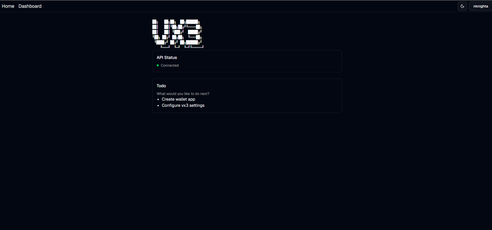

# vx3

The Web3 SDK for Payment, NFT, and more.

 [](https://opensource.org/licenses/Apache-2.0)

## Packages
- package/vx3: The core package of vx3
- apps/web
- apps/server

## Features
<strong>

- No Connection Required of API
- NO Saas Fee
- Multi Chain Supported
- Easy to Use
- Simple API
</strong>

```javascript
import { VX3 } from 'vx3';

const vx3 = new VX3({
  wallet: "",
});

```

## Use Cases
- Payment
- GameFi
- NFT

## Getting Started

### Prerequisites
```
Node.js v16 or later
npm v8 or later
Metamask or other Web3 Wallet
```
### Create App (Web)

#### 1. Dashboard on Web
https://dash.varius.technology/create/project

#### 2. Sign In with CLI
```bash
npx vx3 auth signin
```

Link Project
```bash
npx vx3 link
```

### Create App (CLI)
```bash
npx vx3 create <project-name>
```

### Start Server for Development
```bash
npx vx3 server --debug
```

Port Number
```bash
npx vx3 server --debug --port <port-number>
```

### Specify Path to vx.config.json
```bash
npx vx3 serve -p "../vx.config.json"
```

## Website ScreenShot


## Contributing

## License
Apache-2.0 License

## owner
Nknight AMAMIYA ([@nk4dev](https://nknighta.me/g))